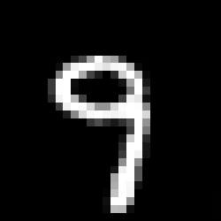

# Reconstruction Attacks in Federated Learning: Privacy Risks and Defense Mechanisms

A small, end-to-end study of **gradient leakage in Federated Learning (FL)**. We build an FL system on MNIST, show that private training images can be reconstructed from the gradients clients share, then evaluate **gradient clipping** and **differential privacy (DP)** as defenses, measuring both privacy protection and model accuracy.

> **Research question:** To what extent can private training data be reconstructed from gradients shared during Federated Learning, and how effectively do gradient clipping and differential privacy mitigate this privacy risk while maintaining model utility?

---

## Table of Contents

1. [Overview](#overview)
2. [Threat Model](#threat-model)
3. [Repository Structure](#repository-structure)
4. [Installation](#installation)
5. [Quick Start](#quick-start)
6. [Task Details](#task-details)
7. [Metrics](#metrics)
8. [Experiments](#experiments)
9. [Results](#results)
10. [Key Findings](#key-findings)
11. [Limitations](#limitations)
12. [References](#references)

---

## Overview

The project is organised as four sequential tasks. Each task consumes the output of the previous one.

```
Task 1: Build FL system  ->  save client gradients / model updates
Task 2: DLG attack       ->  reconstruct private images from saved gradients
Task 3: Defenses         ->  clip + add noise to the same gradients
Task 4: Evaluation       ->  re-run the same attack, compare privacy vs. accuracy
```

| Task | Goal | Main Output |
|------|------|-------------|
| 1 | FL setup with FedAvg on MNIST | Global model, baseline accuracy, saved client updates |
| 2 | DLG-style reconstruction attack | Reconstructed images, MSE / PSNR |
| 3 | Gradient clipping + DP noise | Protected updates, accuracy under defense |
| 4 | Attack vs. defense comparison | Tables, plots, privacy-utility analysis, conclusion |

---

## Threat Model

- **Attacker:** an *honest-but-curious* central server. It follows the FL protocol correctly but tries to infer client data from what it receives.
- **Attacker knowledge:** model architecture, model parameters, loss function, and the gradients / model updates sent by clients. Labels may be known or inferred depending on the attack setup.
- **Attacker does not have:** the original private images.
- **Goal of the attacker:** reconstruct a client's private training image(s) from the shared gradient.

---

## Repository Structure

```
Reconstruction-Attacks-FL/
│
├── task1_fl_setup/
│   ├── dataset.py            # MNIST loading and client partitioning
│   ├── model.py              # PyTorch model
│   ├── client.py             # local training, gradient/update generation
│   ├── server.py             # FedAvg aggregation
│   ├── train.py              # runs the FL training loop
│   ├── models/
│   │   └── global_model.pth
│   └── updates/
│       ├── client1_update.pt
│       ├── client2_update.pt
│       ├── client3_update.pt
│       └── client4_update.pt
│
├── task2_reconstruction_attack/
│   ├── dlg_attack.py         # Deep Leakage from Gradients implementation
│   ├── reconstruction.py     # runs attack on saved gradients, saves outputs
│   ├── metrics.py            # MSE, PSNR, success criteria
│   └── results/
│
├── task3_defenses/
│   ├── gradient_clipping.py
│   ├── differential_privacy.py
│   └── protected_updates/
│
├── task4_evaluation/
│   ├── experiments.py        # runs no-defense / clipping / DP experiments
│   ├── comparison.py         # builds comparison tables
│   ├── plots.py              # generates graphs
│   └── results/
│
├── report/
├── README.md
└── requirements.txt
```

---

## Installation

```bash
git clone https://github.com/<your-username>/Reconstruction-Attacks-FL.git
cd Reconstruction-Attacks-FL

python -m venv venv
source venv/bin/activate        # Windows: venv\Scripts\activate

pip install -r requirements.txt
```

Suggested `requirements.txt`:

```
torch
torchvision
numpy
matplotlib
pandas
scikit-image
tqdm
```

MNIST is downloaded automatically by `torchvision` on first run. A GPU is optional; the single-image attack runs fine on CPU.

---

## Quick Start

Run the tasks in order from the repository root.

```bash
# Task 1 - train FL system, save global model and client updates
python task1_fl_setup/train.py

# Task 2 - reconstruct a private image from a saved client gradient
python task2_reconstruction_attack/reconstruction.py

# Task 3 - generate clipped and noisy (DP) versions of the gradients
python task3_defenses/gradient_clipping.py
python task3_defenses/differential_privacy.py

# Task 4 - re-run the attack on protected gradients, produce tables and plots
python task4_evaluation/experiments.py
python task4_evaluation/comparison.py
python task4_evaluation/plots.py
```

> Adjust script names or arguments if your implementation differs.

---

## Task Details

### Task 1: Federated Learning Setup

- Load MNIST (28x28 grayscale) and split it across multiple clients (e.g. 4).
- Each client receives the global model, trains locally, and produces a gradient / model update.
- The server aggregates updates with **Federated Averaging (FedAvg)** to produce a new global model.
- Client updates and the global model are saved to disk; baseline test accuracy is recorded.

### Task 2: Reconstruction Attack (DLG)

Deep Leakage from Gradients recovers training data by gradient matching:

1. Load the Task 1 model and a saved target gradient.
2. Initialise a random dummy image and dummy label.
3. Compute the gradient of the model on the dummy data.
4. Measure the distance between the dummy gradient and the target gradient.
5. Optimise the dummy image (and label) to minimise that distance.
6. Repeat until the dummy image converges toward the private image.

The first experiment uses a **single MNIST image**. Optional extensions: more iterations, different learning rates, larger batch sizes, multiple images, and different clients.

### Task 3: Defenses

Both defenses are applied to the **same Task 1 gradients** (no separate FL system).

| Defense | Operation | Parameter |
|---------|-----------|-----------|
| Gradient clipping | Rescale gradient so that `‖g‖ <= C` | `C` in {1.0, 0.5, 0.1} |
| Differential privacy | Clip, then add random noise: `g_protected = clip(g, C) + noise` | noise level in {0, 0.01, 0.05, 0.1, 0.5} |

Secure aggregation is discussed as a complementary defense but is not the primary implementation. Exact values should be tuned to the experiment.

### Task 4: Evaluation

The identical Task 2 attack is run against unprotected, clipped, and DP-protected gradients. Reconstruction quality and global model accuracy are compared, and the privacy-utility trade-off is analysed as noise increases.

---

## Metrics

| Metric | Meaning | Better for attacker |
|--------|---------|---------------------|
| **MSE** | Mean squared error between original and reconstructed image | Lower |
| **PSNR** | Peak signal-to-noise ratio (dB) | Higher |
| **Similarity** | Visual / structural similarity (e.g. SSIM) | Higher |
| **Label match** | Original vs. reconstructed label | Match |
| **Attack success** | Reconstruction meets a defined MSE/PSNR threshold | Success |
| **Iterations** | Optimisation steps needed to converge | Fewer |
| **Model accuracy** | Global model test accuracy (utility measure) | Higher is better for utility |

Define your success threshold explicitly (e.g. PSNR above X dB or MSE below Y) and keep it fixed across all experiments.

---

## Experiments

1. **No defense:** FL, original gradient, attack. Record reconstruction quality, MSE, PSNR, success, accuracy.
2. **Gradient clipping:** same pipeline with clipping at several thresholds `C`.
3. **Differential privacy:** clipping plus noise at several noise levels.
4. **Privacy-utility sweep:** vary the noise level and observe reconstruction error against model accuracy.

---

## Results

> Fill in after running the experiments.

### Main comparison

| Defense | Reconstruction | MSE | PSNR (dB) | Accuracy |
|---------|----------------|-----|-----------|----------|
| No defense | High | | | |
| Gradient clipping | Medium | | | |
| Differential privacy | Low | | | |

### Privacy-utility sweep (DP noise)

| Noise | MSE | PSNR (dB) | Attack success | Accuracy |
|-------|-----|-----------|----------------|----------|
| 0 | | | | |
| 0.01 | | | | |
| 0.05 | | | | |
| 0.1 | | | | |
| 0.5 | | | | |

### Plots

Generated into `task4_evaluation/results/`:

1. Noise level vs. reconstruction error
2. Noise level vs. model accuracy
3. Defense method vs. reconstruction quality
4. Defense method vs. model accuracy
5. Privacy protection vs. model utility

### Example reconstructions

| Original | No defense | Clipping | DP |
|----------|-----------|----------|----|
|  |  |  |  |

---

## Key Findings

> Replace with your actual conclusions. Expected narrative:

- Shared gradients can leak private training data: the DLG attack reconstructs MNIST images from unprotected gradients with high fidelity.
- Gradient clipping alone reduces gradient magnitude, but may only partially reduce leakage since the gradient direction is largely preserved.
- Adding DP noise degrades reconstruction substantially as noise grows.
- Increasing noise lowers model accuracy, illustrating the **privacy-utility trade-off**.
- Recommended defense: *(state the clipping threshold and noise level that best balance privacy and accuracy in your results).*

---

## Limitations

- MNIST is simple; results may not transfer directly to larger images or deeper models.
- Single-image and small-batch attacks are far easier than large-batch reconstruction.
- The noise levels here are not tied to a formal `(epsilon, delta)` privacy budget unless you add a privacy accountant.
- Only an honest-but-curious server is considered; malicious servers or colluding clients are out of scope.

---

## References

- Zhu, L., Liu, Z., Han, S. *Deep Leakage from Gradients.* NeurIPS 2019.
- McMahan, B. et al. *Communication-Efficient Learning of Deep Networks from Decentralized Data* (FedAvg). AISTATS 2017.
- Abadi, M. et al. *Deep Learning with Differential Privacy.* CCS 2016.
- Geiping, J. et al. *Inverting Gradients: How Easy Is It to Break Privacy in Federated Learning?* NeurIPS 2020.
- Bonawitz, K. et al. *Practical Secure Aggregation for Privacy-Preserving Machine Learning.* CCS 2017.

---

## License

Add a license of your choice (e.g. MIT) before publishing.
